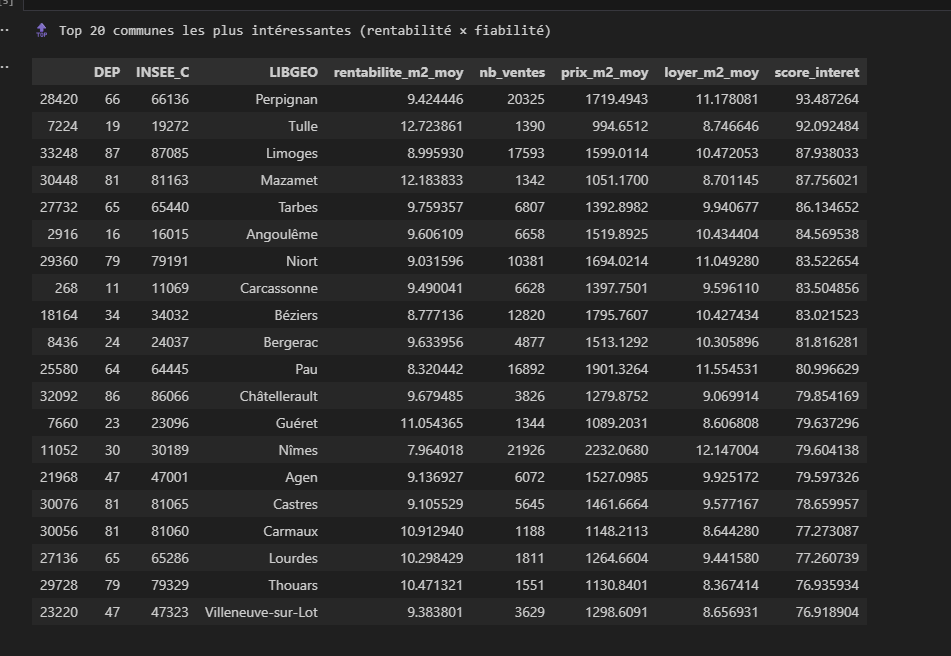
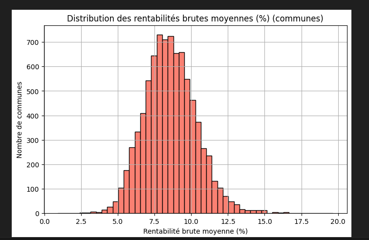
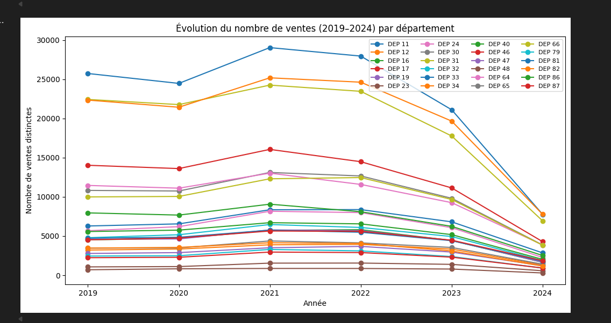
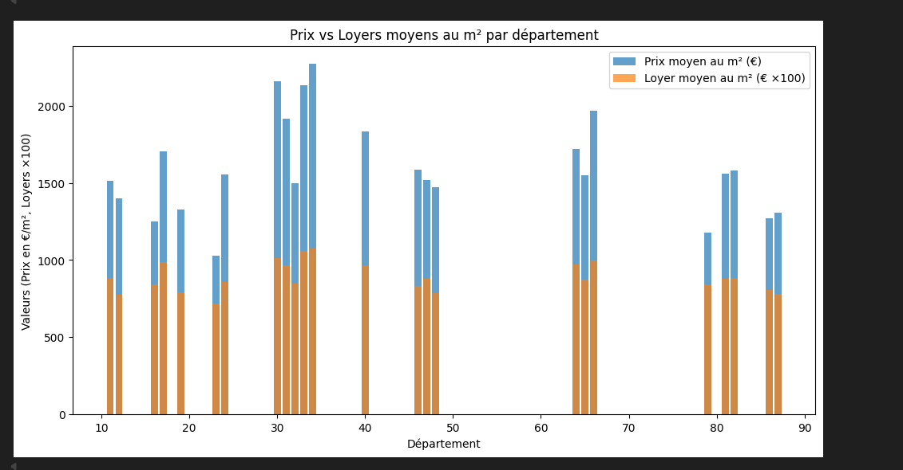
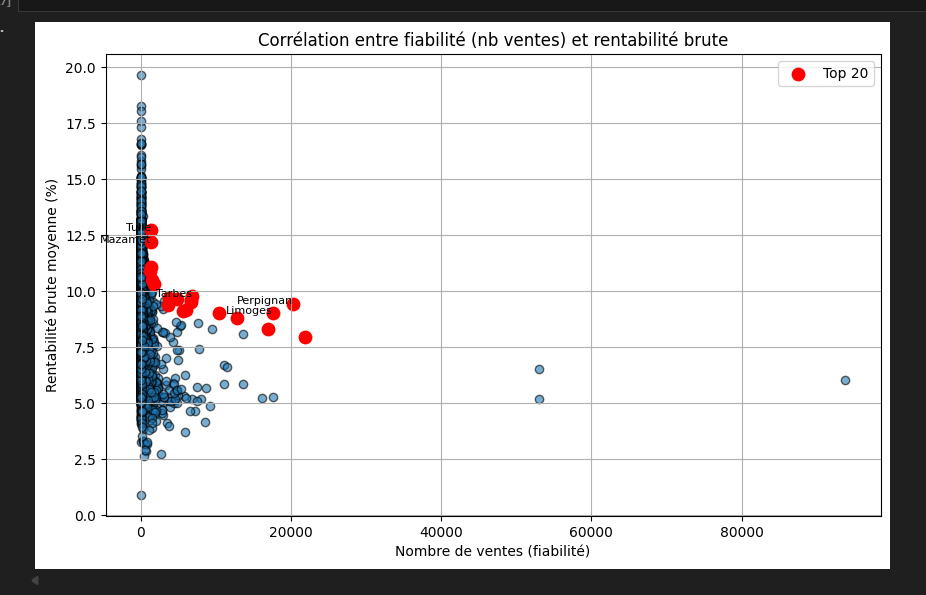
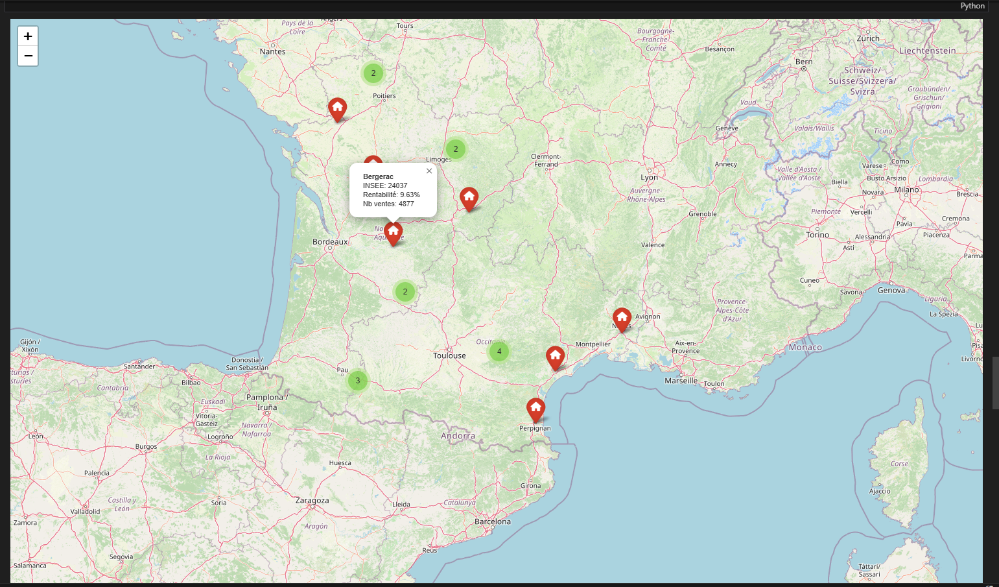
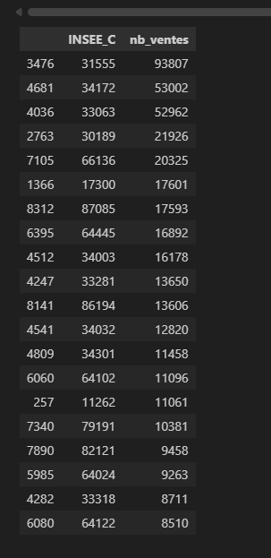

README.md
Projet-analyse_donne_fonciere-main


# 📊 Analyse de Données Foncières pour Investisseurs
> **Projet d'analyse de données immobilières** utilisant les données DVF (Demandes de Valeurs Foncières) et des prédictions de loyers pour identifier les meilleures opportunités d'investissement locatif en France.


---
## 📋 Table des matières
1. [Présentation du projet](#-présentation-du-projet)
2. [Structure du projet](#-structure-du-projet)
3. [Données utilisées](#-données-utilisées)
4. [Méthodologie](#-méthodologie)
5. [Résultats et analyses](#-résultats-et-analyses)
6. [Installation et exécution](#-installation-et-exécution)
7. [Prérequis](#-prérequis)
---
## 🎯 Présentation du projet
Ce projet analyse les transactions immobilières françaises pour aider les investisseurs à identifier les **communes les plus rentables** pour l'investissement locatif. 
### Objectifs principaux :
- 🏠 **Analyser les prix au m²** par département et commune
- 💰 **Calculer la rentabilité brute** (loyer annuel / prix d'achat)
- 📈 **Identifier les tendances** du marché immobilier (2019-2024)
- 🗺️ **Visualiser géographiquement** les opportunités d'investissement
- 🎯 **Recommander les meilleures communes** pour investir
---
## 📁 Structure du projet
```
Projet-analyse_donne_fonciere-main/
├── 📓 01_preparation_donnees.ipynb    # Nettoyage et préparation des données
├── 📓 02_exploration_analyses.ipynb   # Exploration et visualisations
├── 📓 03_application_investisseur.ipynb # Recommandations investisseur
├── 📁 outputs/
│   └── 📁 clean/                      # Données nettoyées (CSV)
├── 📁 screenshots/                    # Captures d'écran des résultats
└── 📄 README.md                       # Ce fichier
```
---
## 📊 Données utilisées
### Sources de données :
| Source | Description |
|--------|-------------|
| **DVF (data.gouv.fr)** | Transactions immobilières 2019-2024 |
| **Prédictions de loyers** | Estimations des loyers au m² par commune |
| **Référentiel INSEE** | Noms et codes des communes françaises |
### Variables clés :
- `prix_m2` - Prix moyen au m² par commune
- `loyer_m2_moy` - Loyer moyen estimé au m²
- `rentabilite_m2_moy` - Rentabilité brute moyenne (%)
- `nb_ventes` - Nombre de transactions (indicateur de fiabilité)
---
## 🔬 Méthodologie
### Notebook 1 : Préparation des données
- Chargement des fichiers DVF par département
- Nettoyage et filtrage des données aberrantes
- Calcul du prix au m² pour chaque transaction
- Agrégation par commune (code INSEE)
### Notebook 2 : Exploration et analyses
- Statistiques descriptives par département
- Distribution des rentabilités
- Évolution temporelle des ventes
- Visualisations graphiques
### Notebook 3 : Application investisseur
- Calcul du score d'intérêt (rentabilité × fiabilité)
- Top 20 des communes recommandées
- Cartographie interactive des opportunités
---
## 📈 Résultats et analyses
### 🔥 Top 10 communes par rentabilité brute moyenne
Les communes avec les meilleures rentabilités brutes identifiées :
| Rang | Commune | Département | Rentabilité (%) | Prix m² (€) | Loyer m² (€) |
|------|---------|-------------|-----------------|-------------|--------------|
| 1 | Consac | 17 | 19.66% | 1 063 € | 9.26 € |
| 2 | Ansost | 65 | 18.25% | 548 € | 8.33 € |
| 3 | Sabarros | 65 | 18.05% | 771 € | 7.59 € |
| 4 | Galinagues | 11 | 17.60% | 1 376 € | 9.30 € |
| 5 | Pradines | 19 | 17.32% | 592 € | 7.49 € |

*Top 10 et Flop 10 des communes par rentabilité brute moyenne*
---
### 🏆 Top 20 communes les plus intéressantes (Score combiné)
Le score d'intérêt combine **rentabilité** et **fiabilité** (nombre de ventes) :

*Classement des 20 communes les plus attractives pour l'investissement*
| Ville | Département | Rentabilité | Nb Ventes | Score |
|-------|-------------|-------------|-----------|-------|
| **Perpignan** | 66 | 9.42% | 20 325 | 93.49 |
| **Tulle** | 19 | 12.72% | 1 390 | 92.09 |
| **Limoges** | 87 | 8.99% | 17 593 | 87.94 |
| **Mazamet** | 81 | 12.18% | 1 342 | 87.76 |
| **Tarbes** | 65 | 9.76% | 6 807 | 86.13 |
---
### 📊 Distribution de la rentabilité brute

*Distribution des rentabilités brutes moyennes par commune*
- **Médiane** : ~8.5% de rentabilité brute
- **Majorité des communes** : entre 6% et 11%
- **Queue de distribution** : quelques communes exceptionnelles > 15%
---
### 📉 Évolution des ventes (2019-2024)

*Évolution du nombre de ventes par département de 2019 à 2024*
**Observations clés :**
- 📈 Pic de transactions en **2021** (reprise post-COVID)
- 📉 Baisse marquée en **2023-2024** (hausse des taux d'intérêt)
- 🔵 Département 66 (Pyrénées-Orientales) : leader en volume
---
### 💹 Prix vs Loyers par département

*Comparaison des prix moyens et loyers moyens au m² par département*
- Les **départements 33 et 34** (Gironde, Hérault) affichent les prix les plus élevés
- Les **loyers restent relativement stables** entre les départements
- Rapport prix/loyer variable = opportunités différenciées
---
### 🔗 Corrélation fiabilité vs rentabilité

*Analyse de la corrélation entre le nombre de ventes et la rentabilité*
- Les **Top 20** (points rouges) présentent un bon équilibre
- Compromis entre **volume de transactions** (fiabilité) et **rentabilité élevée**
---
### 🗺️ Carte interactive des opportunités

*Carte interactive des communes recommandées avec détails au survol*
La carte permet de visualiser géographiquement les opportunités :
- 📍 **Marqueurs verts** : communes du Top 20
- 📍 **Marqueur rouge** : commune sélectionnée
- 💡 Info-bulle avec INSEE, rentabilité et nb de ventes
---
### 📋 Volume de ventes par commune

*Top 20 des communes par volume de transactions*
---
### ⚠️ Communes à faible rentabilité

*Communes avec les rentabilités les plus faibles - zones à éviter*
Les communes de l'**Île de Ré** et du **Bassin d'Arcachon** présentent les rentabilités les plus faibles (< 3%), dues aux prix très élevés.
---
## 🚀 Installation et exécution
### Étape 1 : Cloner le repository
```bash
git clone https://github.com/votre-username/Projet-analyse_donne_fonciere.git
cd Projet-analyse_donne_fonciere
```
### Étape 2 : Installer les dépendances
```bash
pip install pandas numpy matplotlib jupyter folium
```
### Étape 3 : Exécuter les notebooks
```bash
jupyter notebook
```
Exécutez les notebooks dans l'ordre :
1. `01_preparation_donnees.ipynb`
2. `02_exploration_analyses.ipynb`
3. `03_application_investisseur.ipynb`
---
## 📦 Prérequis
| Package | Version |
|---------|---------|
| Python | 3.10+ |
| pandas | 2.0+ |
| numpy | 1.24+ |
| matplotlib | 3.7+ |
| folium | 0.14+ (cartes) |
| jupyter | 1.0+ |
---
## 📝 Conclusion
Ce projet fournit une **analyse complète du marché immobilier français** pour aider les investisseurs à prendre des décisions éclairées. Les communes identifiées dans le **Top 20** représentent un excellent compromis entre :
✅ **Rentabilité attractive** (7-13% brut)  
✅ **Volume de transactions suffisant** (données fiables)  
✅ **Marchés dynamiques** (liquidité)
---
## 👤 Auteur
Projet réalisé dans le cadre d'une analyse de données foncières.
---
*Dernière mise à jour : Février 2026*
